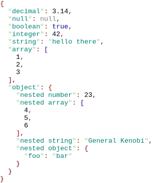
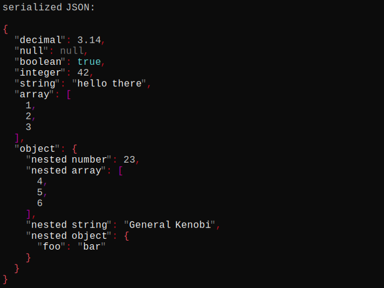

# Examples<a id="top"></a>

* [Visit](#visit)
* [Resolve](#resolve)
* [Escape](#escape)
* [Using `minjson::impl::escape()`](#escape_impl)
* [Serialize](#serialize)
* [Using `minjson::impl::serialize()`](#serialize_impl)
* [Unescape](#unescape)
* [Using `minjson::impl::unescape()`](#unescape_impl)
* [Parse](#parse)
* [Using `minjson::impl::parse()`](#parse_impl)
* [Generate JSON with HTML markup](#print_html)
* [Print JSON with color in console](#print_color)

<a id="visit"></a>
## Visit

[visit.cpp](visit.cpp) demonstrates usage of visitor pattern.

The gist of it is:
```c++
for (const auto &[key, val] : value.asObject()) {
  minjson::visit([](auto &x) { printType(x); }, val);
  std::cout << " for \'" << key << "\'\n";
}
```
Here we iterate over members of an object, use generic lamda as our visitor,
and call oveloaded function `printType()` to print types of member values.

Output can look like this:
```
got a number for 'decimal'
got null for 'null'
got a bool for 'boolean'
got a number for 'integer'
got a string for 'string'
got an array for 'array'
got an object for 'object'
```

[Back to top](#top)

-----

<a id="resolve"></a>
## Resolve

[resolve.cpp](resolve.cpp) demonstrates usage of `resolve()` method to access values throughout JSON document.

The gist of it is `printResolved()` template function:
```c++
template<typename... T>
void printResolved(const minjson::Value &document, T &&...referenceTokens) {
  const auto resolved = document.resolve(std::forward<T>(referenceTokens)...);

  std::cout << (resolved ? "resolved value" : "resolution failed");

  std::cout << " for \'";
  ((std::cout << '/' << referenceTokens), ...);
  std::cout << '\'';

  if (resolved) {
    std::cout << ":\n\n";
    minjson::serializeToStream(std::cout, *resolved);
    std::cout << '\n';
  }
  std::cout << '\n';
}
```

Given JSON `document` and multiple reference tokens we try to resolve a value in the document
by calling `resolve()` method:
```c++
  const auto resolved = value.resolve(std::forward<T>(referenceTokens)...);
```
Here we unpack template parameter pack `referenceTokens` into individual token arguments.\
We store the resulting pointer to a value (of type `const minjson::Value*`) into `resolved` variable.

We print the result of resolution and reference tokens into `stdout`.

Then we check if the value was indeed resolved, and serialize successfully resolved value to `stdout`
using `minjson::serializeToStream()` method.

For different reference tokens output can look like this:
```
resolved value for '/array/1':

2

resolved value for '/object/nested number':

23

resolved value for '/object/nested array/0':

4

resolved value for '/object/nested object/foo':

"bar"

resolution failed for '/nonexistent'
```

[Back to top](#top)

-----

<a id="escape"></a>
## Escape

[escape.cpp](escape.cpp) demonstrates simple JSON-escaping of strings.

The gist of it is:
```c++
const auto string = "string containing special characters: \t \\ \" \n (new line)"sv;

const auto escapedString = minjson::escape(string);

std::cout << "escaping string:\n\n\'" << string << "\'\n\ngives:\n\n\'" << escapedString << "\'\n";
```
Output can look like this:
```
escaping string:

'string containing special characters:   \ " 
 (new line)'

gives:

'string containing special characters: \t \\ \" \n (new line)'
```

Additionally the program accepts strings as the first argument, e.g.:
```
$> escape "string with backslash \ character"
string with backslash \\ character
```

[Back to top](#top)

-----

<a id="escape_impl"></a>
## Using `minjson::impl::escape()`

[escape_impl.cpp](escape_impl.cpp) demonstrates usage of `minjson::impl::escape()` to JSON-escape strings.

For our convenience we define a wrapper function:
```c++
void writeEscapedToStdout(std::string_view s) {
  // a sink repeatedly receives parts of escaped string as 'std::string_view' instances
  const auto stdOutSink = [](std::string_view s) { std::cout << s; };
  // 'minjson::impl::escape()' can be called with any type of sink
  // that is able to receive parts as 'std::string_view' instances
  minjson::impl::escape(stdOutSink,
                        s,
                        minjson::Escape::Default,
                        minjson::Utf8Validation::IgnoreInvalidUtf8CodeUnits,
                        minjson::HexDigitsCase::Upper);
}
```
In this case we output the result directly to `stdout` using `stdOutSink` which is just a lambda
receiving `std::string_view` instances and outputting them into `std::cout`.\
This way we skip creation of temporary `std::string` object that `minjson::escape()` returns.

Otherwise the functionality is the same as in the `minjson::escape()` example [above](#escape).

[Back to top](#top)

-----

<a id="serialize"></a>
## Serialize

[serialize.cpp](serialize.cpp) demonstrates simple JSON serialization/stringification of `minjson::Value` instances.

Here's the gist of it:
```c++
minjson::SerializationOptions options;
options.indent = 2;
options.objectKeyValueSeparator = ": "sv;

const auto serialized = minjson::serializeToString(value, options);

std::cout << "serialized JSON:\n\n" << serialized << '\n';
```
In this case we specify options to indent nested collection members 2 spaces and to have a space
after object key-value separator.

Output can look like this:
```
serialized JSON:

{
  "decimal": 3.14,
  "null": null,
  "boolean": true,
  "integer": 42,
  "string": "hello there",
  "array": [
    1,
    2,
    3
  ],
  "object": {
    "nested number": 23,
    "nested array": [
      4,
      5,
      6
    ],
    "nested string": "General Kenobi",
    "nested object": {
      "foo": "bar"
    }
  }
}
```

[Back to top](#top)

-----

<a id="serialize_impl"></a>
## Using `minjson::impl::serialize()`

[serialize_impl.cpp](serialize_impl.cpp) demonstrates how to use `minjson::impl::serialize()`
to serialize/stringify a `minjson::Value` instance.

In this case we want to print _the whole_ serialized JSON indented 3 spaces.
```c++
std::cout << "serialized JSON:\n\n";

// a sink repeatedly receives parts of serialized string as 'std::string_view' instances
const auto stdOutSink = [](std::string_view s) { std::cout << s; };

minjson::SerializationOptions options;
options.indent = 2;
options.objectKeyValueSeparator = ": "sv;

std::cout << "   "sv;                 // need to indent the first line
const size_t initialIndentation = 3;  // indent the whole output

// 'minjson::impl::serialize()' can be called with any type of sink
// that is able to receive parts as 'std::string_view' instances
minjson::impl::serialize(stdOutSink, value, options, initialIndentation);

std::cout << '\n';
```
We output the result directly to `stdout` using `stdOutSink` which is just a lambda
receiving `std::string_view` instances and outputting them into `std::cout`.

We indent the first line ourselves because `minjson::impl::serialize()` indents only members of nested collections.
```c++
std::cout << "   "sv;
```

Then we call `minjson::impl::serialize()` specifying the _sink_, _value_, _options_ and the indentation we want:
```c++
minjson::impl::serialize(stdOutSink, value, options, initialIndentation);
```

Output can look like this:
```
serialized JSON:

   {
     "decimal": 3.14,
     "null": null,
     "boolean": true,
     "integer": 42,
     "string": "hello there",
     "array": [
       1,
       2,
       3
     ],
     "object": {
       "nested number": 23,
       "nested array": [
         4,
         5,
         6
       ],
       "nested string": "General Kenobi",
       "nested object": {
         "foo": "bar"
       }
     }
   }
```

[Back to top](#top)

-----

<a id="unescape"></a>
## Unescape

[unescape.cpp](unescape.cpp) demonstrates simple JSON-unescaping of strings.

The gist of it:
```c++
const auto string = R"(string containing escaped characters: \t \\ \n \" (new line))"sv;

const auto unescapedString = minjson::unescape(string);

std::cout << "unescaping string:\n\n\'" << string << "\'\n\ngives:\n\n\'" << unescapedString << "\'\n";
```
Output can look like:
```
unescaping string:

'string containing escaped characters: \t \\ \" \n (new line)'

gives:

'string containing escaped characters:   \ " 
 (new line)'
```

Additionally the program accepts strings as the first argument, e.g.:
```
$> unescape "string with tab \t character"
string with tab          character
```

[Back to top](#top)

-----

<a id="unescape_impl"></a>
## Using `minjson::impl::unescape()`

[unescape_impl.cpp](unescape_impl.cpp) demonstrates usage of `minjson::impl::unescape()` to JSON-unescape strings.

Here's the gist of the functionality:
```c++
const auto string = R"(string containing escaped characters: \t \\ \" \n (new line))"sv;

std::cout << "unescaping string:\n\n\'" << string << "\'\n\ngives:\n\n\'";

const auto stdOutSink = [](std::string_view s) { std::cout << s; };
minjson::impl::unescape(stdOutSink, string, minjson::UnescapeMode::Relaxed);

std::cout << "\'\n";
```
We output the result directly to `stdout` using `stdOutSink` which is just a lambda
receiving `std::string_view` instances and outputting them into `std::cout`.\
This way we skip creation of temporary `std::string` object that `minjson::unescape()` returns.

Output can look like this:
```
unescaping string:

'string containing escaped characters: \t \\ \" \n (new line)'

gives:

'string containing escaped characters:   \ " 
 (new line)'
```


Additionally the program accepts strings as the first argument, here's the code for it:
```c++
if (argc > 1) {
  const auto input = std::string_view{ argv[1] };
  if (!input.empty()) {
    // storage for unescaped string
    std::string unescapedString;
    // a sink repeatedly receives parts of unescaped string as 'std::string_view' instances
    const auto stringSink = [&unescapedString](std::string_view s) { unescapedString += s; };
    // 'minjson::impl::unescape()' can be called with any type of sink
    // that is able to receive parts as 'std::string_view' instances
    //
    // 'minjson::impl::unescape()' returns size of successfully unescaped input
    const auto unescapedSize = minjson::impl::unescape(stringSink, input, minjson::UnescapeMode::Relaxed);
    // if returned size != input size, input contains an invalid character or ends unexpectedly
    if (unescapedSize != input.size()) {
      if (unescapedSize == minjson::impl::NPos) {
        std::cerr << "failed to unescape string, unexpected end of input\n";
      } else {
        std::cerr << "failed to unescape string, invalid character at offset " << unescapedSize << '\n';
      }
      return 1;
    }
    std::cout << unescapedString;
  }
  return 0;
}
```
Unescaping can fail, that's why we unescape the input into a string object using `stringSink` lambda,
check the size of actually unescaped input, and output unescaped string
if the unescaped size is the same as input size, or report an error.

[Back to top](#top)

-----

<a id="parse"></a>
## Parse

[parse.cpp](parse.cpp) demonstrates parsing of JSON into a `minjson::Value` instance.

The gist of the code:
```c++
// parsing JSON
const auto value = minjson::parse(string).value;

std::cout << "parsed JSON:\n\n";
print(value);
std::cout << '\n';
```

Output can look like this:
```
parsed JSON:

{
  "null": null,
  "decimal": 3.14,
  "boolean": true,
  "integer": 42,
  "string": "hello there",
  "array": [
    1,
    2,
    3
  ],
  "object": {
    "nested number": 23,
    "nested string": "General Kenobi",
    "nested array": [
      4,
      5,
      6
    ],
    "nested object": {
      "foo": "bar"
    }
  }
}
```

Additionally the program accepts strings as the first argument, and
uses `stdin` when `-i` command line option is provided.\
Here's the code relevant to parsing:
```c++
// parsing input JSON
const auto [value, status, parsedSize, issues] = minjson::parse(input);
// 'status' tells if the parsing succeeded
// 'parsedSize' tells how many bytes are successfully parsed from the input
// 'issues' contain information about different issues and errors encountered during parsing

switch (status) {
case minjson::ParsingResultStatus::Success:
  break;

case minjson::ParsingResultStatus::PartialSuccess:
  // report issues
  // ...
  break;

case minjson::ParsingResultStatus::Failure:
  // report issues
  // ...
  return 1;
}
std::cout << "parsed JSON:\n\n";
print(value);
std::cout << '\n';
```
Here the return value of `minjson::parse()` is decomposed using structured bindings into
the parsed _value_, _status_ of parsing result, parsed size of input, and a list of _issues_.

Using input specification may look like this:
```
$> parse "[1, 2, \"three\"]"
parsed JSON:

[
  1,
  2,
  "three"
]

$> parse -i < hello_world.json
parsed JSON:

{
  "greeting": "Hello, world!"
}
```

[Back to top](#top)

-----

<a id="parse_impl"></a>
## Using `minjson::impl::parse()`

[parse_impl.cpp](parse_impl.cpp) demonstrates how to use `minjson::impl::parse()` to
parse JSON into `minjson::Value` instances.

Here we implement parsing of [NDJSON](https://github.com/ndjson):
```c++
minjson::Array parseNDJson(std::string_view input) {
  minjson::Array values;
  while (!input.empty()) {
    // parsing JSON
    // 'minjson::impl::parse()' ends parsing at the end of a valid JSON value and never parses beyond that
    auto [value, status, parsedSize, issues] = minjson::impl::parse(input, {}, std::allocator<char>{});
    // 'status' tells if the parsing succeeded
    // 'parsedSize' tells how many bytes are successfully parsed from the input
    // 'issues' contain information about different issues and errors encountered during parsing

    if (status == minjson::ParsingResultStatus::Failure) {
      std::cerr << "failed to parse line " << values.size();
      printIssues(input, issues);
      std::cerr << '\n';
      break;
    }
    // storing successfuly parsed JSON value
    values.push_back(std::move(value));
    // skipping '\r' before '\n' if there is one
    const auto n = input.find_first_not_of('\r', parsedSize);
    if (n == std::string_view::npos)
      break;  // reached end of input
    if (input[n] != '\n') {
      std::cerr << "unexpected character\n";
      break;  // not NDJSON
    }
    input.remove_prefix(n + 1);
  }
  return values;
}
```
We specify default options (second parameter `{}` in the call to `minjson::impl::parse()`) and
allocator as the third parameter.

The return value is decomposed using structured bindings into the parsed _value_, _status_ of parsing result,
parsed size of input, and a list of _issues_.

On JSON parsing failure, or on encountering end of line other than `[\r]\n` we report an error.

Then we call our function and print parsed values:
```c++
// parsing newline delimeted JSON values
const auto values = parseNDJson(input);

if (values.empty()) {
  std::cout << "input is empty\n";
} else {
  std::cout << "parsed JSON values:";
  for (const auto &value : values) {
    std::cout << "\n\n";
    print(value);
  }
  std::cout << '\n';
}
```

Output can look like this:
```
parsed JSON values:

{
  "decimal": 3.14
}

{
  "null": null
}

{
  "boolean": true
}

{
  "integer": 42
}

{
  "string": "hello there"
}

{
  "array": [
    1,
    2,
    3
  ]
}

{
  "object": {
    "nested number": 23,
    "nested array": [],
    "nested string": "General Kenobi",
    "nested object": {}
  }
}
```

Additionally the program accepts strings as the first argument, and
uses `stdin` when `-i` command line option is provided, e.g.:
```
$> parse_impl -i < ndjson.txt
parsed JSON values:

{
  "some": "thing"
}

{
  "foo": 17,
  "bar": false,
  "baz": true
}

{
  "may": {
    "include": "nested",
    "objects": [
      "and",
      "arrays"
    ]
  }
}
```

[Back to top](#top)

-----

<a id="print_html"></a>
## Generate JSON with HTML markup

[print_html.cpp](print_html.cpp) demonstrates how to use serialization options
to generate serialized JSON with HTML markup.

Here's the gist of the code:
```c++
minjson::SerializationOptions options;
options.indent = 2;
options.nullLiteral = R"(<span style="color: gray;">null</span>)"sv;
options.falseLiteral = R"(<span style="color: blue;">false</span>)"sv;
options.trueLiteral = R"(<span style="color: blue;">true</span>)"sv;
options.emptyObject = R"(<span style="color: red;">{}</span>)"sv;
options.objectOpeningBrace = R"(<span style="color: red;">{</span>)"sv;
options.objectClosingBrace = R"(<span style="color: red;">}</span>)"sv;
options.objectKeyValueSeparator = R"(<span style="color: darkred;">: </span>)"sv;
options.objectMemberSeparator = R"(<span style="color: darkred;">,</span>)"sv;
options.emptyArray = R"(<span style="color: magenta;">[]</span>)"sv;
options.arrayOpeningBracket = R"(<span style="color: magenta;">[</span>)"sv;
options.arrayClosingBracket = R"(<span style="color: magenta;">]</span>)"sv;
options.arrayMemberSeparator = R"(<span style="color: darkmagenta;">,</span>)"sv;
options.openingStringQuotation = R"(<span style="color: lightgray;">"</span><span style="color: teal;">)"sv;
options.closingStringQuotation = R"(</span><span style="color: lightgray;">"</span>)"sv;

std::cout << "<pre>\n";
minjson::serializeToStream(std::cout, value, options);
std::cout << "\n</pre>";
```


<details>
<summary>Click/tap to see example raw output.</summary>

```html
<pre>
<span style="color: red;">{</span>
  <span style="color: lightgray;">"</span><span style="color: teal;">decimal</span><span style="color: lightgray;">"</span><span style="color: darkred;">: </span>3.14<span style="color: darkred;">,</span>
  <span style="color: lightgray;">"</span><span style="color: teal;">null</span><span style="color: lightgray;">"</span><span style="color: darkred;">: </span><span style="color: gray;">null</span><span style="color: darkred;">,</span>
  <span style="color: lightgray;">"</span><span style="color: teal;">boolean</span><span style="color: lightgray;">"</span><span style="color: darkred;">: </span><span style="color: blue;">true</span><span style="color: darkred;">,</span>
  <span style="color: lightgray;">"</span><span style="color: teal;">integer</span><span style="color: lightgray;">"</span><span style="color: darkred;">: </span>42<span style="color: darkred;">,</span>
  <span style="color: lightgray;">"</span><span style="color: teal;">string</span><span style="color: lightgray;">"</span><span style="color: darkred;">: </span><span style="color: lightgray;">"</span><span style="color: teal;">hello there</span><span style="color: lightgray;">"</span><span style="color: darkred;">,</span>
  <span style="color: lightgray;">"</span><span style="color: teal;">array</span><span style="color: lightgray;">"</span><span style="color: darkred;">: </span><span style="color: magenta;">[</span>
    1<span style="color: darkmagenta;">,</span>
    2<span style="color: darkmagenta;">,</span>
    3
  <span style="color: magenta;">]</span><span style="color: darkred;">,</span>
  <span style="color: lightgray;">"</span><span style="color: teal;">object</span><span style="color: lightgray;">"</span><span style="color: darkred;">: </span><span style="color: red;">{</span>
    <span style="color: lightgray;">"</span><span style="color: teal;">nested number</span><span style="color: lightgray;">"</span><span style="color: darkred;">: </span>23<span style="color: darkred;">,</span>
    <span style="color: lightgray;">"</span><span style="color: teal;">nested array</span><span style="color: lightgray;">"</span><span style="color: darkred;">: </span><span style="color: magenta;">[</span>
      4<span style="color: darkmagenta;">,</span>
      5<span style="color: darkmagenta;">,</span>
      6
    <span style="color: magenta;">]</span><span style="color: darkred;">,</span>
    <span style="color: lightgray;">"</span><span style="color: teal;">nested string</span><span style="color: lightgray;">"</span><span style="color: darkred;">: </span><span style="color: lightgray;">"</span><span style="color: teal;">General Kenobi</span><span style="color: lightgray;">"</span><span style="color: darkred;">,</span>
    <span style="color: lightgray;">"</span><span style="color: teal;">nested object</span><span style="color: lightgray;">"</span><span style="color: darkred;">: </span><span style="color: red;">{</span>
      <span style="color: lightgray;">"</span><span style="color: teal;">foo</span><span style="color: lightgray;">"</span><span style="color: darkred;">: </span><span style="color: lightgray;">"</span><span style="color: teal;">bar</span><span style="color: lightgray;">"</span>
    <span style="color: red;">}</span>
  <span style="color: red;">}</span>
<span style="color: red;">}</span>
</pre>
```
</details>

Rendered HTML:



[Back to top](#top)

-----

<a id="print_color"></a>
## Print JSON with color in console

[print_color.cpp](print_color.cpp) demonstrates colorization of JSON elements using terminal escape sequences.

The code looks like this:
```c++
minjson::SerializationOptions options;
options.indent = 2;
options.nullLiteral = "\x1b[90mnull\x1b[0m";
options.falseLiteral = "\x1b[96mfalse\x1b[0m";
options.trueLiteral = "\x1b[96mtrue\x1b[0m";
options.emptyObject = "\x1b[91m{}\x1b[0m";
options.objectOpeningBrace = "\x1b[91m{\x1b[0m";
options.objectClosingBrace = "\x1b[91m}\x1b[0m";
options.objectKeyValueSeparator = "\x1b[31m:\x1b[0m ";
options.objectMemberSeparator = "\x1b[31m,\x1b[0m";
options.emptyArray = "\x1b[95m[]\x1b[0m";
options.arrayOpeningBracket = "\x1b[95m[\x1b[0m";
options.arrayClosingBracket = "\x1b[95m]\x1b[0m";
options.arrayMemberSeparator = "\x1b[35m,\x1b[0m";
options.openingStringQuotation = "\x1b[90m\"\x1b[97m";
options.closingStringQuotation = "\x1b[90m\"\x1b[0m";

std::cout << "serialized JSON:\n\n";
minjson::serializeToStream(std::cout, value, options);
std::cout << '\n';
```
You can read about terminal escape sequences e.g.
[here](https://en.wikipedia.org/wiki/ANSI_escape_code#Fe_Escape_sequences)
and about colors
[here](https://en.wikipedia.org/wiki/ANSI_escape_code#SGR_(Select_Graphic_Rendition)_parameters).

Output can look like this:



[Back to top](#top)